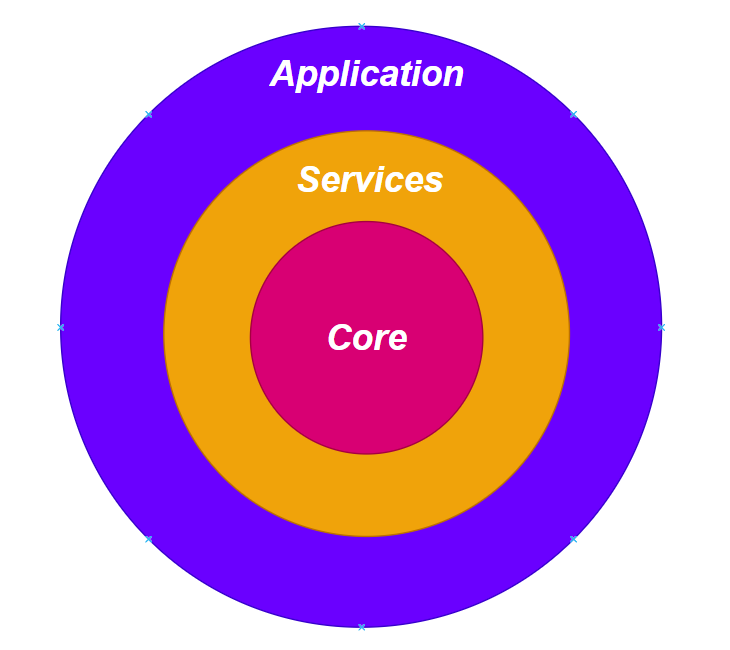
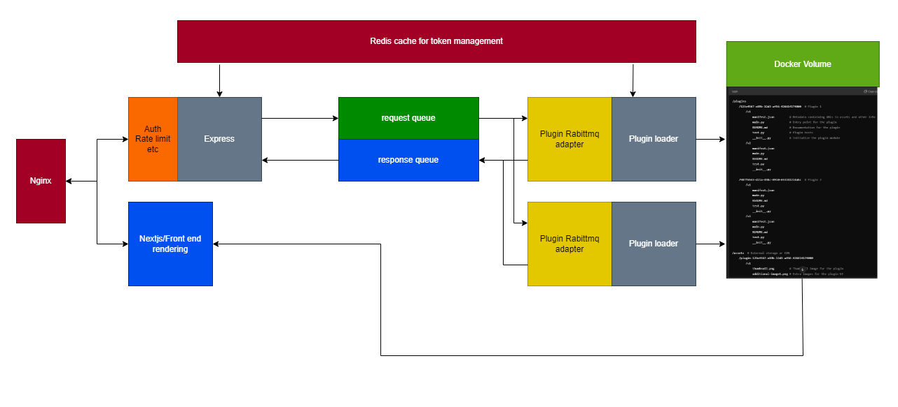
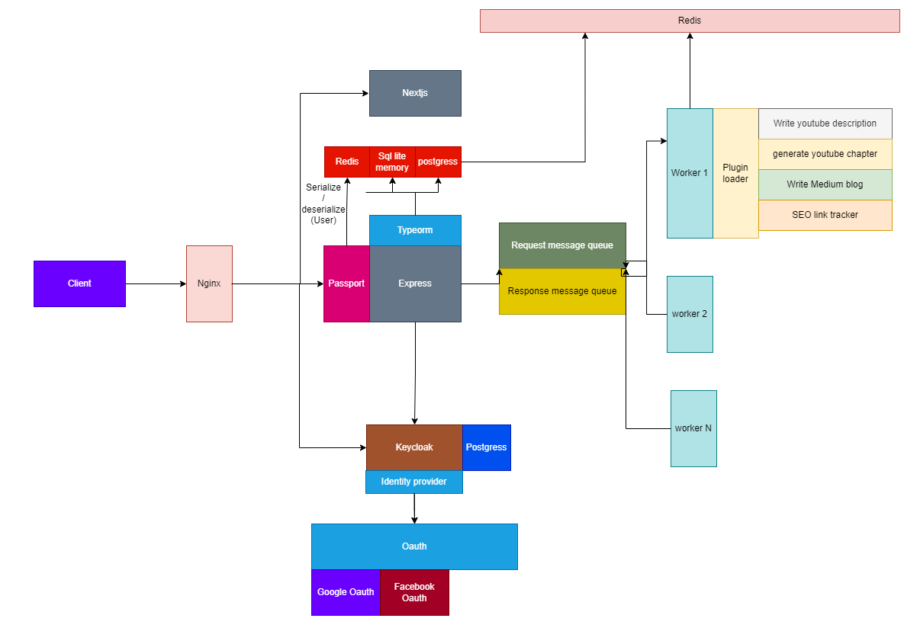
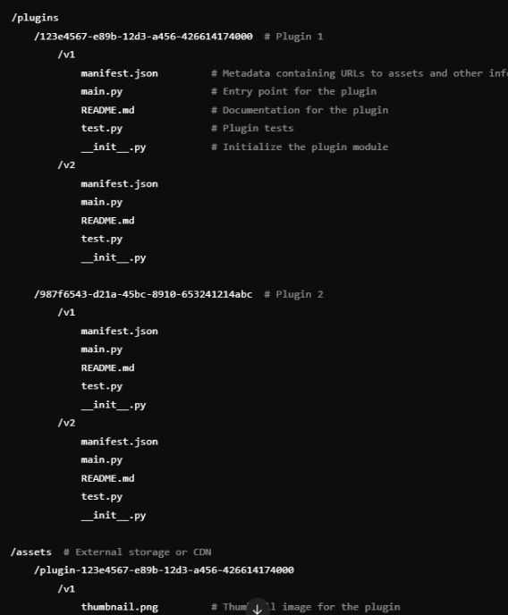

# Ideariver

Welcome to the **Ideariver** repository! This is the central monorepo for the IdeaRiver ecosystem, hosting various submodules that enable scalable development and seamless integration of different projects within the platform.

## 🎯 Objective

**IdeaRiver** is an open-source platform designed to help content creators streamline their workflow by providing micro-tools that assist with daily tasks such as content generation, SEO tracking, and more. The platform is built to be **modular** and **collaborative**, allowing contributors from around the world to build new tools or integrate existing ones into their own infrastructure.

The system’s **plugin-based architecture** ensures that content creators can easily extend functionality by using tools created by the community. Whether you’re looking to automate YouTube description generation, blog writing, or other content tasks, IdeaRiver provides the infrastructure to scale your work and collaborate with other developers to improve your tools.

### Key Benefits:
- **Modular Micro-tools**: The platform offers small, task-specific tools that can be used independently or integrated into existing workflows.
- **Community Collaboration**: Open to contributions from developers worldwide, making it easy to build and share new tools.
- **Seamless Integration**: Easily integrates into existing infrastructures, so content creators and businesses can leverage the tools without major disruptions.
  
Join the **IdeaRiver** community and help expand the platform with tools that solve real-world content creation challenges!

---


## 🚀 Introduction

**IdeaRiver** is a modular, scalable platform designed with cutting-edge technologies to manage various digital services and applications. The platform is built with a combination of modern development paradigms, including **Domain-Driven Design (DDD)**, **Event-Driven Architecture**, **Microservices**, and a highly flexible **Plugin System Architecture**. These paradigms are powered by a robust set of tools and libraries to ensure flexibility, efficiency, and scalability.

### Key Architectural Concepts:

- **Domain-Driven Design (DDD)**: DDD helps in structuring the codebase around core business domains, with a clear separation of concerns between the domain logic, infrastructure, and services. This makes the system highly maintainable and adaptable to business changes.

<div align="center">
  
</div>

- **Event-Driven Architecture**: By decoupling services and leveraging message queues like **RabbitMQ**, IdeaRiver enables efficient and asynchronous communication between services. This approach ensures the platform can handle high traffic, scalability, and real-time processing requirements.

<div align="center">
  
</div>

- **Microservices**: The platform is designed as a collection of loosely coupled, independently deployable services, ensuring flexibility and scalability. Each service manages its own lifecycle, making the platform resilient to failure and easily extensible.

<div align="center">
  
</div>


- **Plugin System Architecture**: IdeaRiver supports a dynamic **plugin-based architecture**, allowing new features to be added or updated independently, without modifying the core platform. The plugin loader dynamically loads different plugins (e.g., for writing YouTube descriptions, generating chapters, SEO tracking, etc.), enabling the platform to handle a wide variety of tasks. This architecture allows easy extensibility and modularity, making it easier to maintain and scale the system.

<div align="center">
  
</div>

## 📂 Submodule Structure

The repository is organized into various submodules, structured as follows:

### **/core**
#### **ideariver-core-python**  
The **ideariver-core** is the foundational library of the IdeaRiver ecosystem. It provides essential abstract classes, DTOs, and interfaces that facilitate integration between services and plugins. This library is designed to be lightweight and extensible.

#### Repository:
[ideariver-core-python](https://github.com/nima70/ideariver-core-python.git)

#### **ideariver.schemas**  
The **ideariver.schemas** repository serves as the centralized location for managing language-independent event schemas. These schemas are critical for ensuring standardized communication between services in a distributed, event-driven architecture.

#### Repository:
[ideariver.schemas](https://github.com/nima70/ideariver.schemas.git)

#### **ideariver.core.public**  
The **ideariver.core** is a foundational package designed for IdeaRiver as part of the Domain-Driven Design (DDD) architecture. It serves as the core of the system, containing Data Transfer Objects (DTOs) and interfaces that are completely abstract, with zero dependencies on other libraries.

#### Key Features:
- Domain-Driven Design (DDD) Core Layer
- DTO and Interfaces
- Zero Dependencies

#### Purpose:
- Provides a centralized repository for core abstractions that can be used across all IdeaRiver services and applications.
- Ensures separation of concerns by keeping core logic isolated from business and infrastructure layers.

#### Repository:
[ideariver.core.public](https://github.com/nima70/ideariver.core.public.git)

---

### **/services**
#### **ideariver-services-python**  
The **Ideariver Services Python** repository provides essential services used across the IdeaRiver ecosystem. These services include plugin management, RabbitMQ messaging, and input validation. The services are designed to be modular, reusable, and scalable.

#### Key Features:
- Dynamic plugin loading based on JSON configurations
- Modular plugin architecture allowing independent plugin development
- RabbitMQ adapter for message queue-based plugin execution
- Pytest for automated plugin testing

#### Repository:
[ideariver-services-python](https://github.com/nima70/ideariver-services-python.git)

---
#### **ideariver.services.server.public**  
The **IdeaRiver Services Server** repository is a robust Node.js library for building scalable backend services with a focus on security, modularity, and extensibility. It provides a comprehensive solution for handling CRUD operations, authentication, and middleware management, built on top of **Express** and **TypeORM**.

#### Features:
- **Abstracted CRUD Operations**: Simplifies the implementation of Create, Read, Update, Delete (CRUD) functionalities.
- **OpenID Connect Authentication**: Seamlessly integrates with Keycloak for secure authentication and authorization.
- **Middleware Support**: Offers customizable pre- and post-processing through middleware.
- **Security Enhancements**: Includes rate limiting, Helmet for security headers, and CSRF protection.
- **Database Support**: Works out of the box with PostgreSQL and SQLite databases.
- **Extensive Test Coverage**: Comes with Jest and Supertest tests to ensure reliability.


---

### **/app**
#### **ideariver.terraform**  
The **Ideariver.terraform** repository demonstrates how to manage infrastructure as code (IaC) using Terraform. This project covers the complete infrastructure for the IdeaRiver application, showcasing best practices in scalability, security, and modularity.

  
### [Watch this video on YouTube](https://youtu.be/7lbS1U30gGs)

#### Key Features:
- AWS EC2, ECR, Route53, SES, and IAM management
- Reusable Terraform modules for modular infrastructure
- Security best practices with IAM roles and least privilege access

#### Repository:
[ideariver.terraform](https://github.com/nima70/ideariver.terraform.git)

#### **ideariver.client.web**  
The **Ideariver Landing Page & Blogging Website** showcases the digital marketing services provided by IdeaRiver. This project includes a responsive landing page and a blogging platform designed to attract local customers and demonstrate custom web development skills.

  
### [Watch this video on YouTube](https://youtu.be/t84rtdkWBuk)

#### Key Features:
- Landing Page for promoting services
- Blogging platform with SEO optimization
- Video production and integration
- Storybook for UI component exploration

#### Technologies:
Next.js, Tailwind CSS, ShadCN UI, TypeScript, AWS, Terraform, Ansible, and Express.

#### Resources:
- [Live Website](https://ideariver.ca)
- [Storybook for Ideariver](https://nima70.github.io/ideariver.client.web/)
- [Repository](https://github.com/nima70/ideariver.client.web.git)

---

### **/config**
#### **ideariver.config.public**  
The **Ideariver.config** repository contains essential configuration files that are shared across the IdeaRiver platform. These configurations help manage events and handle platform-wide settings efficiently.

#### Repository:
[ideariver.config.public](https://github.com/nima70/ideariver.config.public.git)

---

## 🔧 Setup Instructions

This monorepo supports seamless integration with its submodules, allowing easy management and updates across the ecosystem. Ensure you explore each submodule’s repository for detailed instructions on how to integrate and manage them within your own projects.

---

### 🛠 Quick Start

To get started with IdeaRiver, follow these steps:
Clone the repository:

```bash
git clone --recurse-submodules https://github.com/nima70/ideariver.git
```
Navigate to the repository directory:

```bash
cd ideariver
```
Initialize and update submodules:
If the repository was cloned without the --recurse-submodules flag, initialize and update the submodules manually:
```bash
git submodule init
git submodule update --recursive
```
---

## ❤️ Please Contribute

We welcome contributions to help make the **IdeaRiver** platform even better! Whether you want to report issues, suggest features, or submit pull requests, your help is greatly appreciated. Together, we can build something amazing!

<div align="center">
  
</div>

---

## 📃 License
This project is licensed under the **MIT License**.

Thank you for exploring the **ideariver** repository! Stay tuned for upcoming features and enhancements. 🚀


### 🙏 Thank You for Visiting!
I'm glad you stopped by. Let's create something awesome together!

<div align="center">
  
</div>